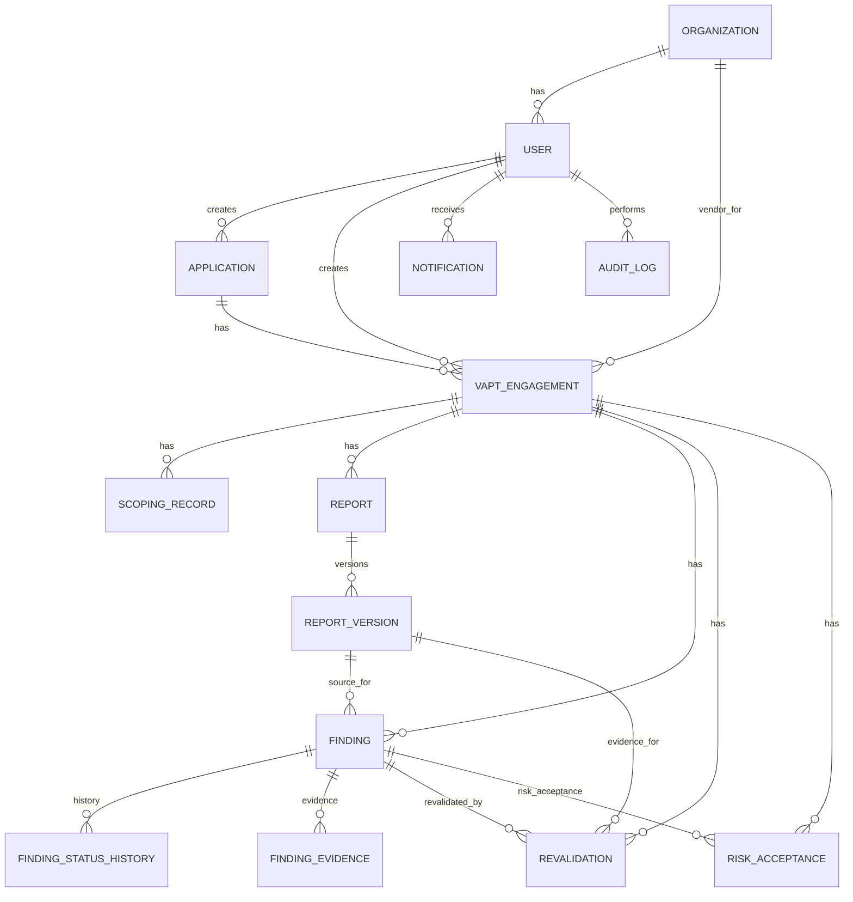
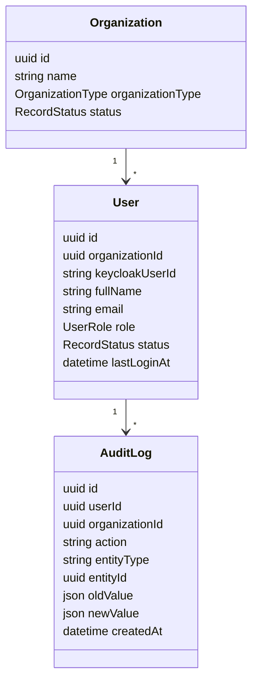
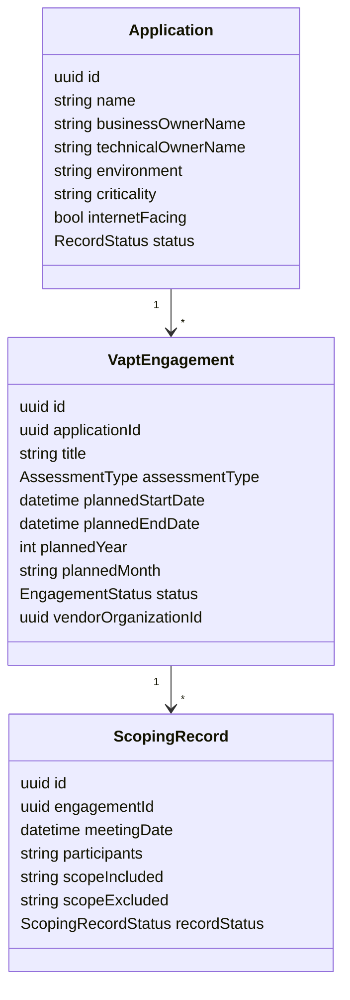
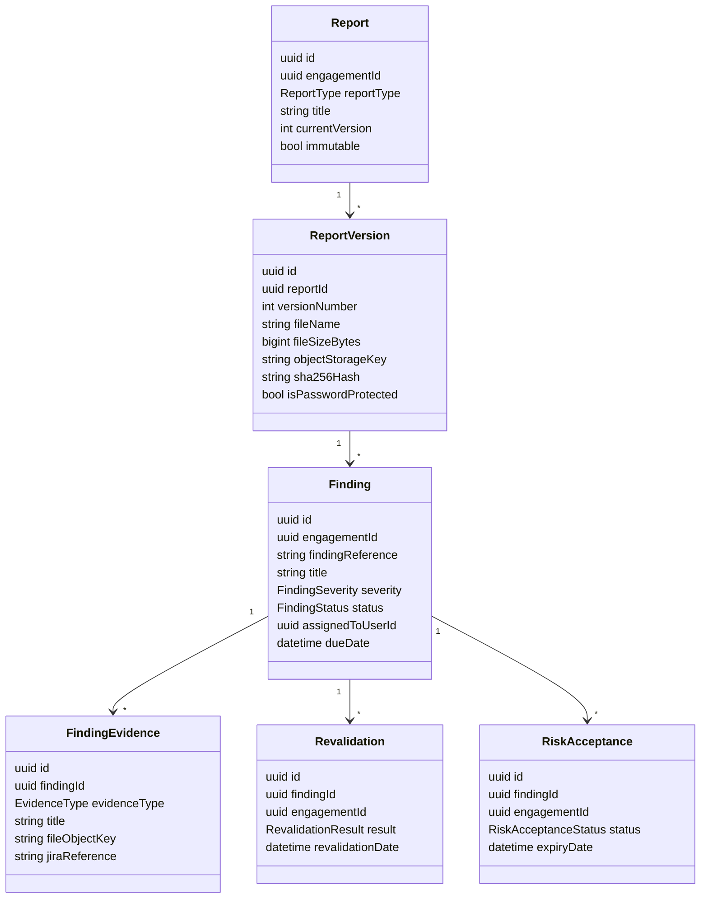
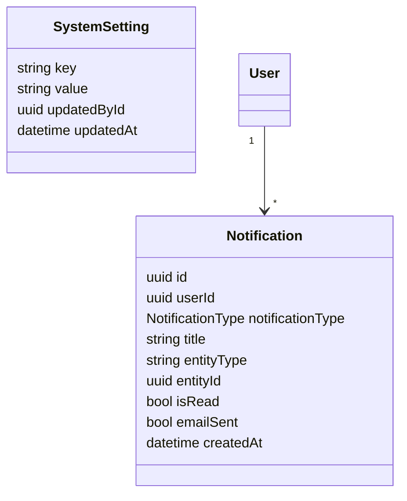

# SecureTracker Data Model

Current software version: `v0.18.9`  
Documentation baseline: `v0.18.10`  
Source of truth: `prisma/schema.prisma`

## Core Entity Relationship Model

## Governance And Identity

Organizations are the workflow parties, not arbitrary departments:

- NBP: Client / Bank governance party
- Paysys Labs: SaaS service provider / portal operator
- Apprise: VAPT service provider

## Engagement And Scoping

Schedule health is derived at read time from engagement status plus planned start/end dates. It is not stored in the database.

## Reports, Findings, And Risk

Report and evidence files are stored in object storage. PostgreSQL stores metadata, ownership, workflow state, and audit trail data.

## Operational Entities

System settings are global portal settings. They currently control default page size, schedule-health warning days, notification reminder days, risk acceptance expiry reminder days, email enablement, scheduler enablement, and audit retention target.

## Current Seeded Data

The reset baseline is validation data only:

- 3 organizations
- 7 demo users
- 23 screenshot-derived applications
- 45 2026 engagements
- 22 Whitebox and 23 Black/Grey assessments
- no seeded scoping records, reports, findings, risk acceptances, tickets, or synthetic application records
