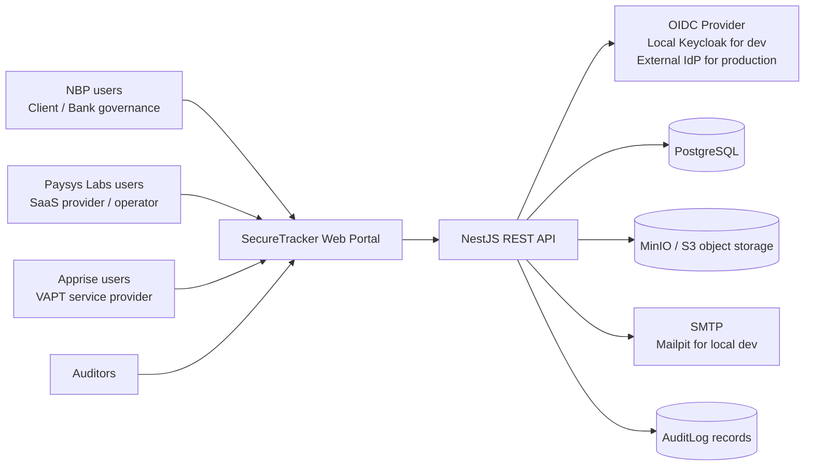
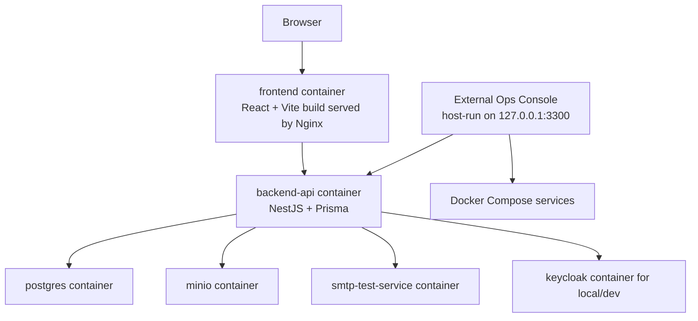
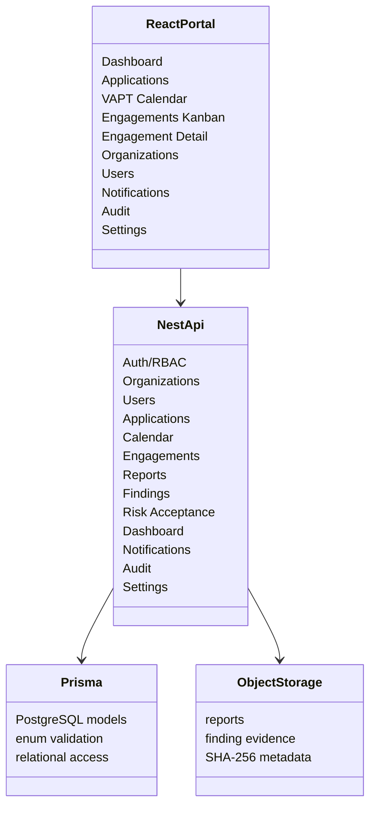
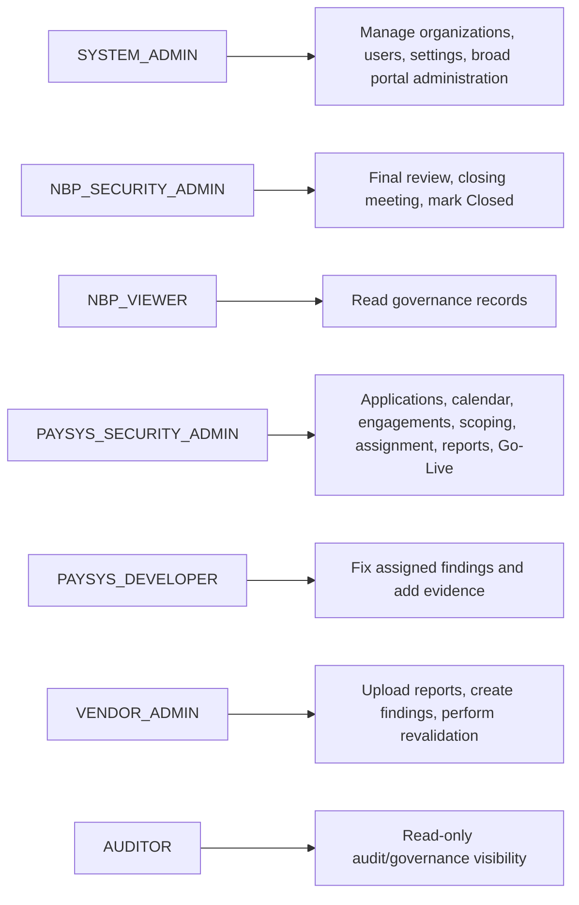
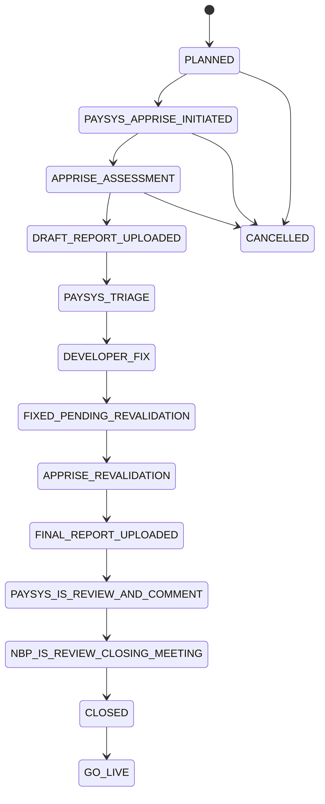
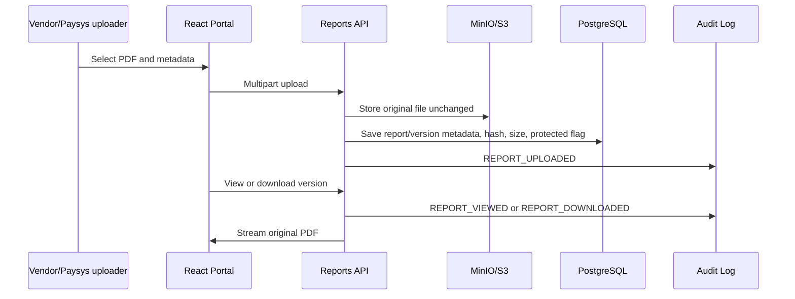
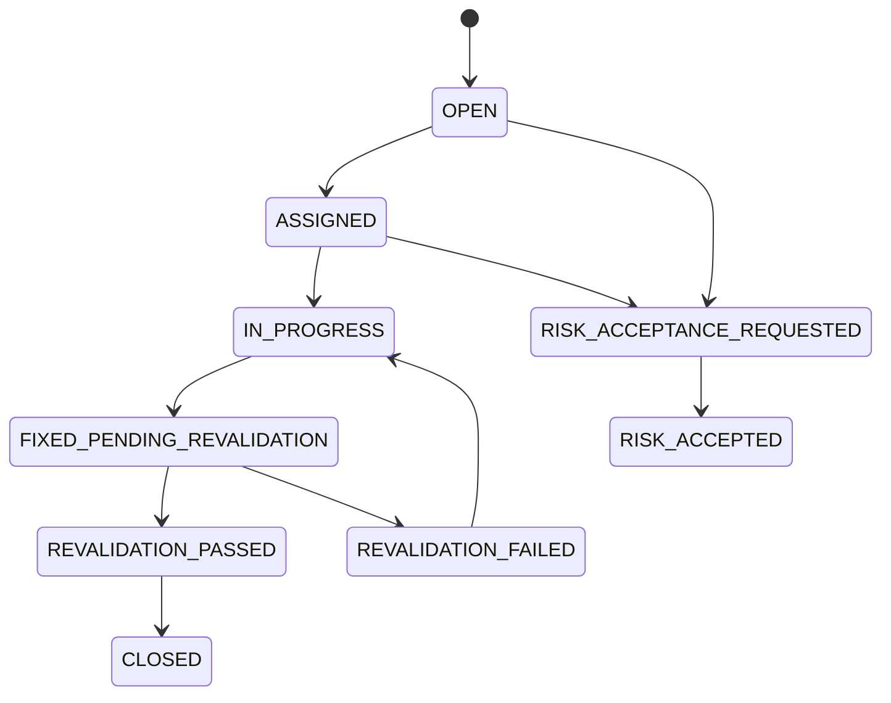
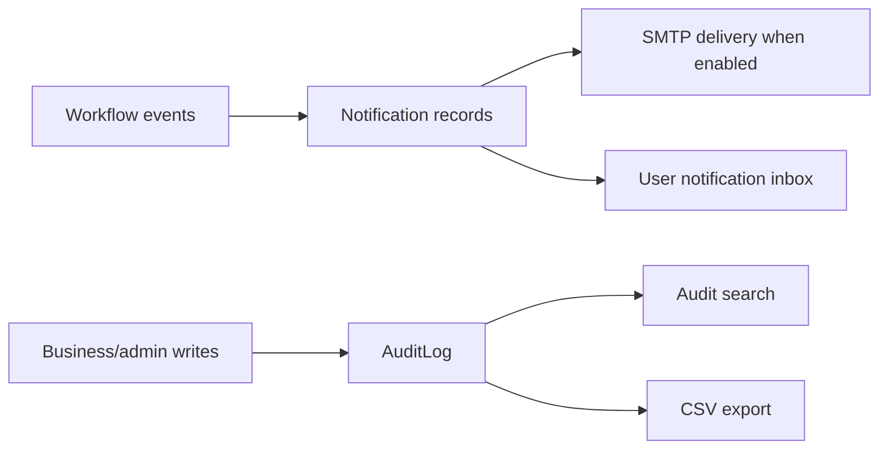
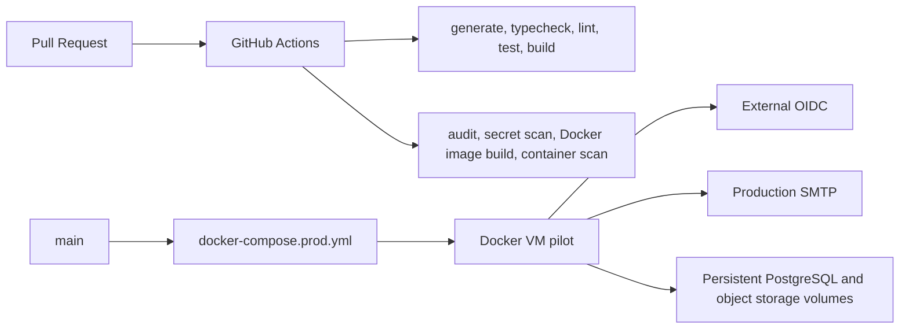

# SecureTracker Product Architecture

Current software version: `v0.18.9`  
Documentation baseline: `v0.18.10`

## Purpose

SecureTracker is a Dockerized VAPT tracking portal for NBP, Paysys Labs, Apprise, and auditors. It provides a single audited workflow for application inventory, annual VAPT calendar planning, engagement Kanban tracking, scoping notes, report storage, findings remediation, revalidation, risk acceptance, notifications, dashboards, audit search, and system settings.

## System Context

## Container Architecture

The Ops Console is intentionally outside the product containers. It is a local operator tool for health checks, regression execution, cleanup, and seeded reset. It is not deployed as part of production.

## Application Components

## Role Model

Backend RBAC is the final authority. The frontend hides navigation and actions where possible, but every sensitive API operation is role checked server-side.

## Engagement Lifecycle

NBP attendance is optional for the first Paysys-Apprise initiation meeting. NBP does not approve the initial scope. NBP Security Admin remains the only role authorized to move an engagement to `CLOSED`.

## Report And PDF Flow

Password-protected PDFs remain encrypted. PDF passwords are entered only in the browser viewer and are not stored, logged, or submitted as metadata.

## Findings And Revalidation Flow

Vendor Admin creates findings and records revalidation results. Paysys Security Admin triages and assigns. Paysys Developer fixes assigned findings, uploads evidence, and marks findings `FIXED_PENDING_REVALIDATION`.

## Notifications And Audit

Notification windows, email enablement, scheduler enablement, schedule-health warning days, default page size, and audit retention target are global system settings.

## Deployment And CI

Local development uses Docker Compose with PostgreSQL, Keycloak, MinIO, Mailpit, backend, and frontend. Production pilot deployment uses production Compose assets, external OIDC, real SMTP, persistent volumes, and documented backup/restore procedures.

## Current Seeded Baseline

`npm.cmd run reset:seeded` restores:

- 3 organizations: NBP, Paysys Labs, Apprise
- 7 demo users
- 23 screenshot-derived applications
- 45 2026 engagements
- 22 Whitebox and 23 Black/Grey assessments
- no seeded scoping records, reports, findings, risk acceptances, tickets, or synthetic applications
