# SecureTracker User Guide

Current software version: `v0.18.9`  
Documentation baseline: `v0.18.10`

This guide describes the current SecureTracker portal using the screenshot-derived seeded baseline. Screenshots are stored in `docs/assets/screenshots/v0.18.10/`.

## Sign In

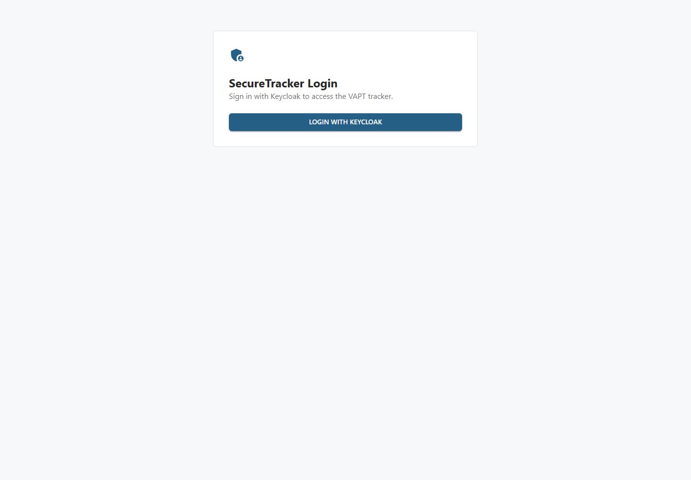

Use **Login with Keycloak**. Local development uses the seeded Keycloak realm and demo users. Production is expected to use an external OIDC provider.

## Dashboard

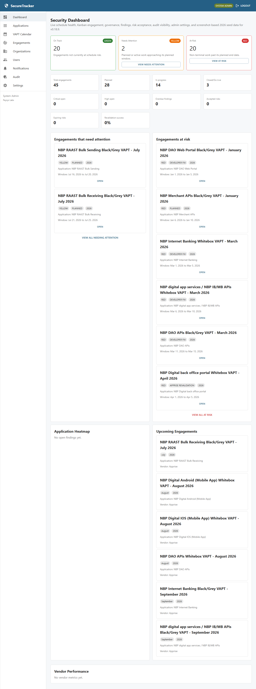

Dashboard shows live counts and schedule-health cards. On Track, Needs Attention, and At Risk are derived from planned dates, engagement status, and the configured schedule-health warning window. Needs Attention and At Risk cards link into filtered Engagements Kanban views.

## Applications

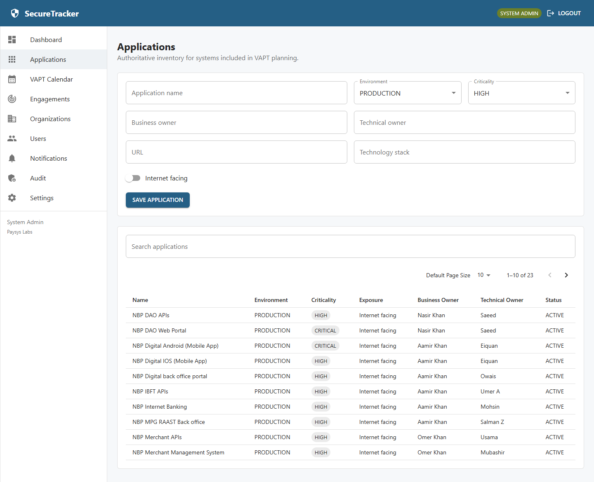

Applications are shown in a paginated table. Use search and filters to narrow the list. The screenshot-derived baseline contains 23 applications. Paysys Security Admin and System Admin roles can create or update application inventory records.

## VAPT Calendar

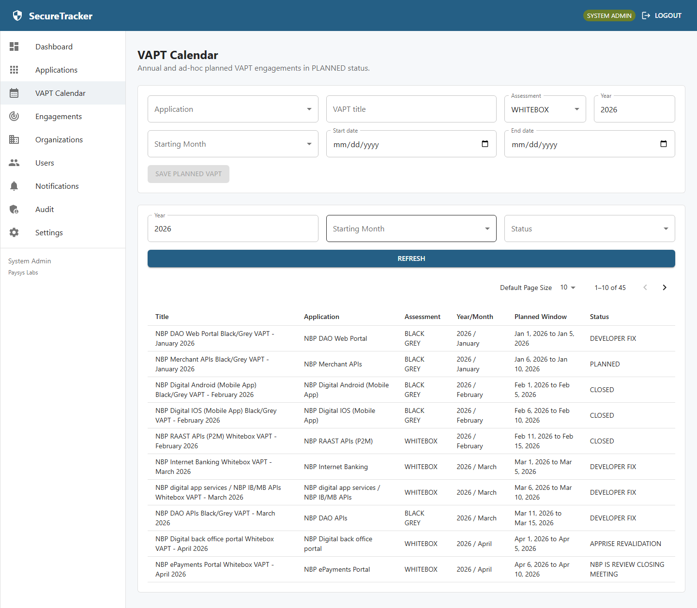

The VAPT Calendar lists annual assessment entries with Year and Starting Month filters. The current seeded baseline contains 45 2026 engagements: 22 Whitebox and 23 Black/Grey. Creating a calendar entry creates one engagement record and duplicate submissions are protected.

## Engagements Kanban

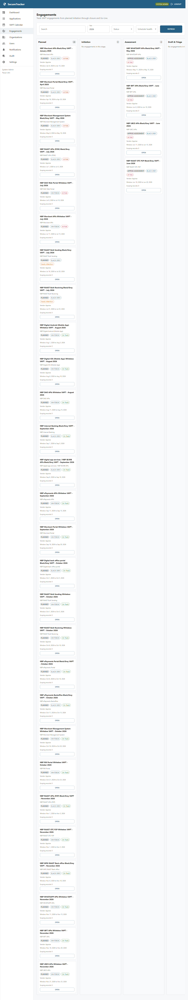

Engagements are grouped by lifecycle phase. Filters for year, status, search text, and schedule health combine together. Kanban cards show application, vendor, assessment type, planned window, lifecycle status, schedule-health chip, scoping count, and an Open action.

## Engagement Detail

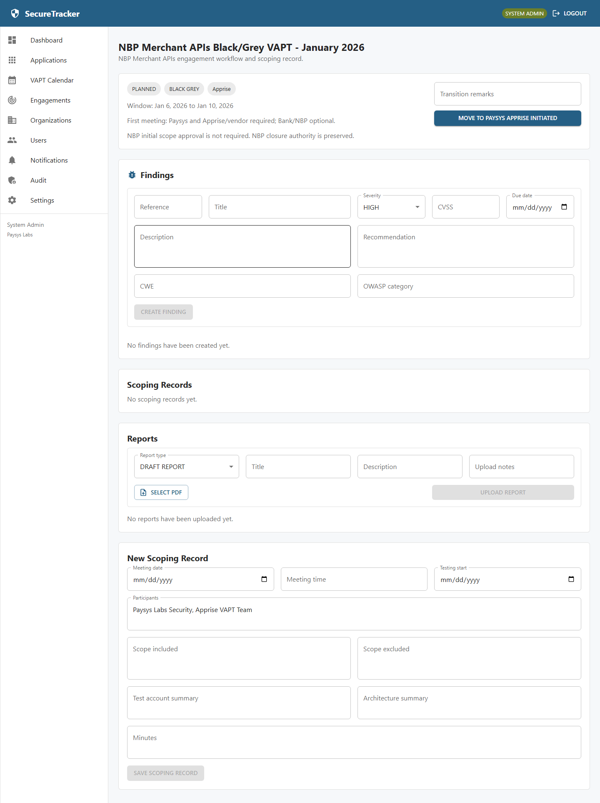

The engagement detail page is the workflow workspace. It supports status transition controls, scoping records, reports, findings, evidence, revalidation, and risk acceptance where role permissions and workflow state allow. The screenshot seed baseline intentionally does not create scoping records, reports, findings, or risk acceptances.

## Report Repository And PDF Viewer

Reports are managed from the engagement detail page. Upload requires a PDF file, report type, title, optional description, and upload notes. Report versions store file metadata, SHA-256 hash, password-protected flag, uploader, and upload time.

Password-protected PDFs remain encrypted. Users enter a PDF password only in the browser viewer; the password is not stored, logged, or sent as report metadata.

## Findings, Evidence, And Revalidation

Vendor Admin users create findings for an engagement. Paysys Security Admin users triage and assign findings. Paysys Developer users upload evidence and mark assigned findings `Fixed (Pending Revalidation)`. Vendor Admin users record revalidation as passed or failed.

Failed revalidation returns the finding to the developer workflow. Passed findings can move toward closure or risk acceptance depending on governance decision.

## Risk Acceptance

Paysys Security Admin users can request risk acceptance for unresolved findings. NBP Security Admin users review and approve or reject. Approved risk acceptance moves the finding to `RISK_ACCEPTED` and remains visible in dashboards and audit history.

## Organizations

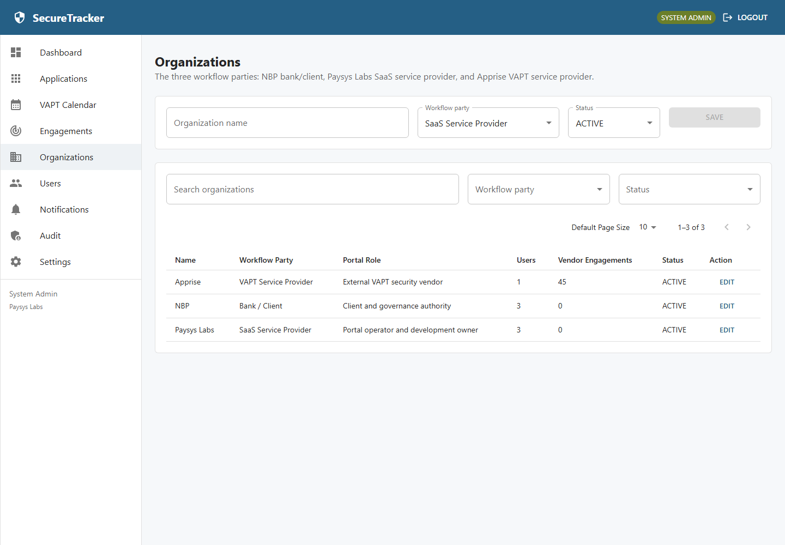

Organizations represent the workflow parties:

- NBP: Client / Bank governance party
- Paysys Labs: SaaS service provider / portal operator
- Apprise: VAPT service provider

The page shows organization type, status, user counts, and vendor engagement counts. System Admin can create and update organizations.

## Users

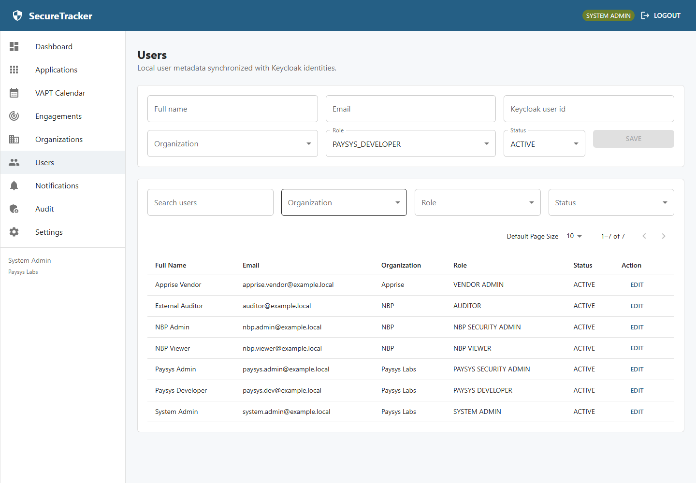

Users are local metadata synchronized with Keycloak identities. The page shows full name, email, organization, role, status, and edit actions for System Admin. Users navigation is visible only to roles with access.

## Notifications

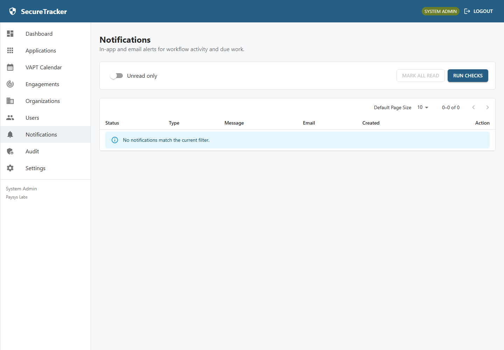

Notifications show workflow alerts, read state, and email delivery state. Users can mark individual notifications or all notifications as read. System Admin can run due checks when operationally needed.

## Audit Search And Export

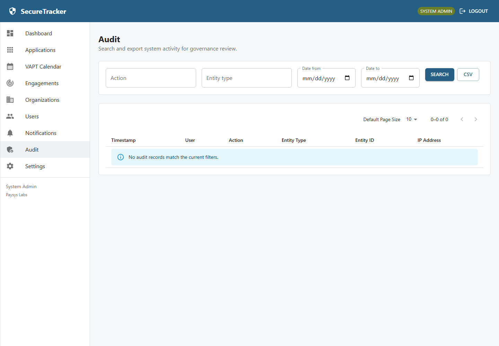

Audit search supports filtering by action, entity type, user, organization, and date range. CSV export includes the filtered audit records and creates an `AUDIT_EXPORTED` audit event.

## Settings

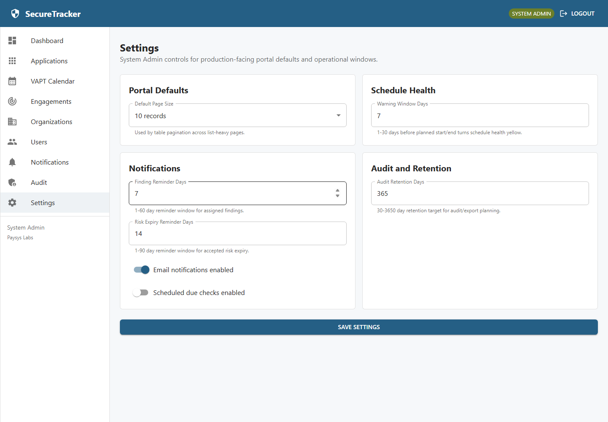

System Admin users manage global portal settings:

- Default page size
- Schedule-health warning days
- Notification reminder days
- Risk acceptance expiry reminder days
- Notification email enablement
- Notification scheduler enablement
- Audit retention target

Settings changes are audited.

## External Ops Console

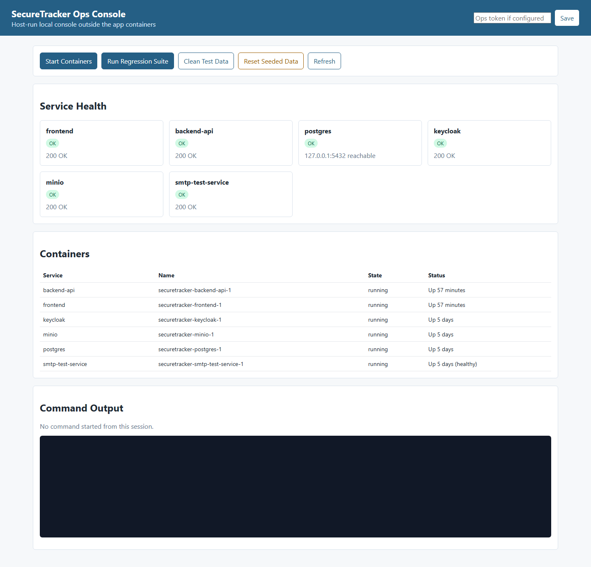

The Ops Console runs outside the application at `http://127.0.0.1:3300` for local/dev operations. It monitors Docker Compose services, runs regression tests, cleans `REGRESSION_` data, and resets seeded validation data. It is not part of the production application.

## Seeded Baseline

`npm.cmd run reset:seeded` restores:

- 3 workflow-party organizations
- 7 demo users
- 23 screenshot-derived applications
- 45 2026 VAPT engagements
- 22 Whitebox and 23 Black/Grey assessments
- no seeded scoping records, reports, findings, risk acceptances, ticket records, or synthetic applications
