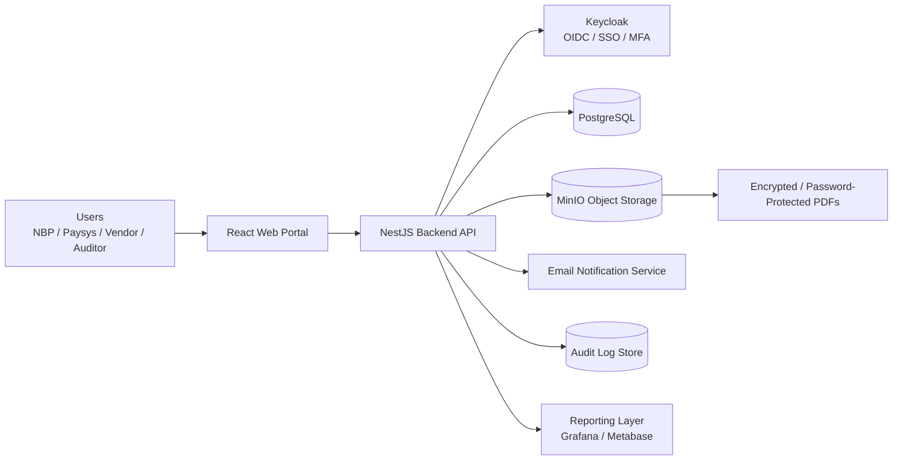
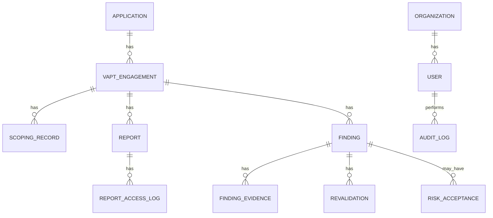
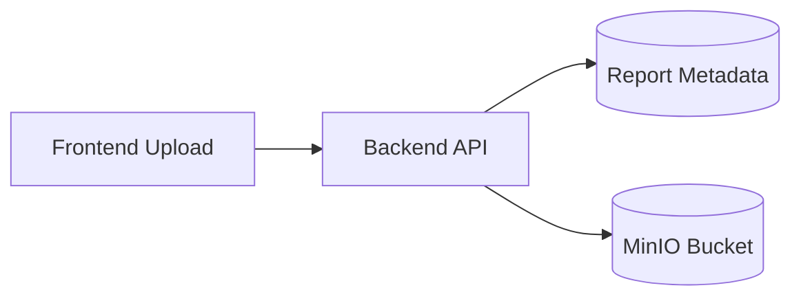
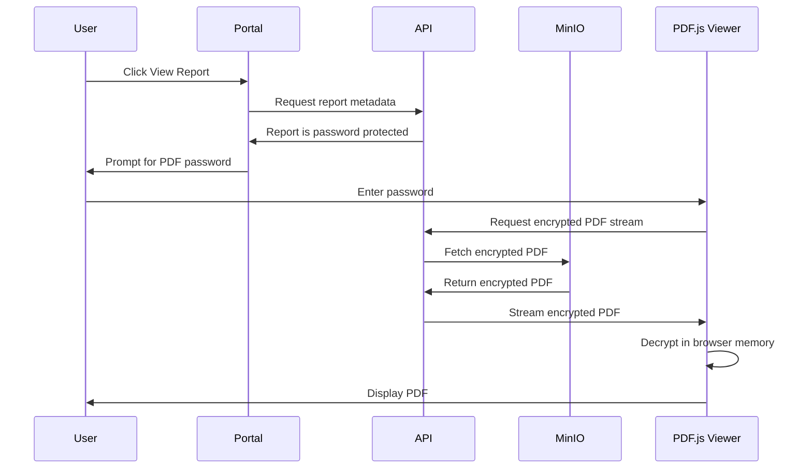
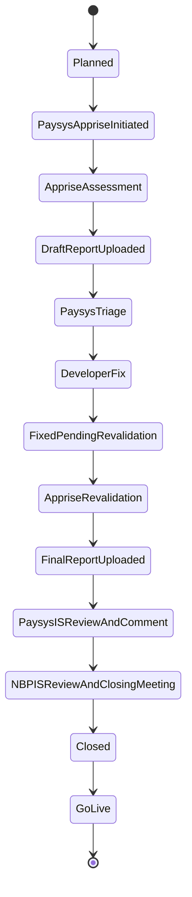
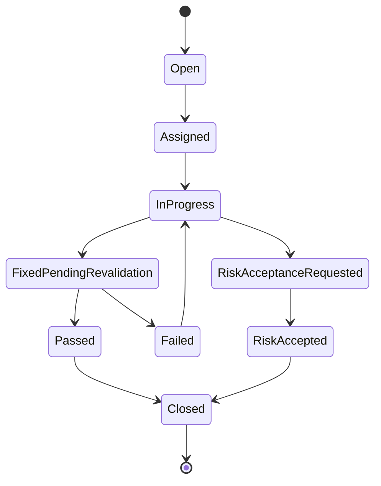
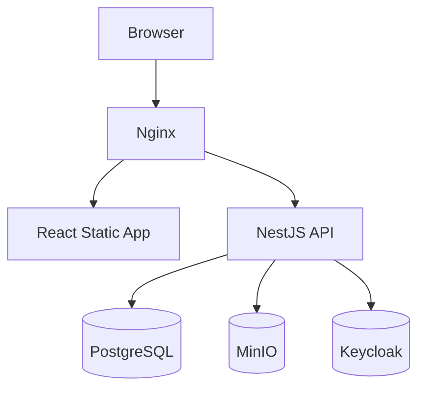

# VAPT Tracker Portal Architecture

## Version 1.0

---

# 1. Architecture Objective

The VAPT Tracker Portal is designed as a secure, auditable, role-based collaboration platform for:

- NBP
- Paysys Labs
- External VAPT Vendors such as Apprise
- Auditors and Management

The architecture must support:

- Annual VAPT calendar management
- Engagement initiation and scoping, beginning with Paysys and Apprise / External VAPT Vendor coordination while Bank / NBP attendance is optional for the first meeting
- Secure report repository
- Password-protected PDF handling
- Findings lifecycle tracking
- Remediation and revalidation workflow
- Risk acceptance
- Dashboards and reporting
- Full audit trail

---

# 2. High-Level Architecture



---

# 3. Suggested Technology Stack

## Frontend

- React
- TypeScript
- Vite
- Material UI
- PDF.js for report viewing

## Backend

- Node.js
- NestJS
- TypeScript
- REST APIs

## Database

- PostgreSQL

## Authentication

- Keycloak
- OIDC / OAuth2
- MFA support

## Object Storage

- MinIO
- S3-compatible storage

## Reporting

- Grafana or Metabase

## Deployment

- Docker Compose for MVP
- Kubernetes-ready for future deployment

---

# 4. Logical System Components

## 4.1 Web Portal

The web portal provides role-based access to:

- Dashboard
- Annual VAPT Calendar
- Application Inventory
- Engagements
- Scoping Records
- Reports
- Findings
- Risk Acceptance
- Audit Logs

The frontend must not expose unauthorized data. However, authorization must always be enforced by backend APIs.

---

## 4.2 Backend API

The backend API is responsible for:

- Authentication token validation
- Role-based authorization
- Business workflow enforcement
- CRUD operations
- Report metadata handling
- File upload and download controls
- Audit logging
- Notification triggers
- Dashboard aggregation

Recommended backend pattern:

```text
Controller → Service → Repository → Database / Object Storage
```

---

## 4.3 Authentication & Identity

Keycloak should manage:

- Users
- Organizations
- Roles
- MFA
- Session policies
- Password policies

Recommended organization model:

```text
Organization
 ├── NBP
 ├── Paysys
 └── Vendor
      └── Apprise
```

Each user belongs to one organization and one or more roles.

---

# 5. Role-Based Access Control

## Roles

| Role | Organization | Access Level |
|---|---|---|
| NBP Security Admin | NBP | Full governance access and only role authorized to close engagements |
| NBP Viewer | NBP | Read-only |
| Paysys Security Admin | Paysys | Full portal administration except closing engagements |
| Paysys Developer | Paysys | Assigned findings and fix status updates |
| Vendor Admin | Vendor | Upload reports, create findings, revalidate |
| Auditor | Any / Independent | Read-only audit access |
| System Admin | Platform | User and configuration management |

---

## Access Control Rules

### NBP Security Admin

Can:

- View all engagements
- Add new ad-hoc VAPT engagements and reports for mid-year projects
- View reports
- Perform final review and closing meeting
- Approve risk acceptance
- Close engagements. This is the ONLY role authorized to mark an engagement as Closed.
- View audit logs

### Paysys Security Admin

Can:

- View all Paysys-related engagements
- Add ad-hoc projects and reports
- Update engagement statuses except Closed
- Move engagement status to Go-Live
- Manage findings
- Initiate VAPT with Apprise
- Assign findings
- Upload remediation evidence
- Request revalidation
- Review final reports and coordinate with NBP
- View reports

### Paysys Developer

Can:

- View findings assigned to them
- Update remediation notes
- Upload fix evidence
- Mark findings as fixed
- Support production deployment after closure

### Vendor Admin

Can:

- Upload draft reports
- Upload final reports
- Create findings
- Revalidate findings
- Upload revalidation reports

### Auditor

Can:

- View all records
- Export reports
- View audit logs
- Cannot modify data

---

# 6. Data Architecture

## Core Entities



---

## Main Tables

### organizations

Stores NBP, Paysys, Vendor organizations.

Key fields:

- id
- name
- organization_type
- status
- created_at

---

### users

Stores portal users.

Key fields:

- id
- organization_id
- keycloak_user_id
- full_name
- email
- role
- status
- created_at

---

### applications

Stores application inventory.

Key fields:

- id
- name
- business_owner
- technical_owner
- environment
- url
- criticality
- technology_stack
- internet_facing
- status

---

### vapt_engagements

Stores each VAPT run.

Key fields:

- id
- application_id
- title
- assessment_type
- planned_start_date
- planned_end_date
- actual_start_date
- actual_end_date
- vendor_id
- status
- created_by
- closed_at

---

### scoping_records

Stores scoping meeting details.

The first Engagement Initiation meeting is between Paysys and Apprise / External VAPT Vendor. Bank / NBP attendance is optional and should be recorded in participants when present.

Key fields:

- id
- engagement_id
- meeting_date
- participants
- scope_included
- scope_excluded
- testing_window
- test_accounts_summary
- minutes
- record_status

---

### reports

Stores report metadata. Actual file is stored in MinIO.

Key fields:

- id
- engagement_id
- report_type
- file_name
- object_storage_key
- file_hash
- is_password_protected
- uploaded_by
- uploaded_at
- version
- immutable
- status

---

### findings

Stores each vulnerability.

Key fields:

- id
- engagement_id
- finding_reference
- title
- description
- recommendation
- severity
- status
- assigned_to
- due_date
- cwe
- owasp_category
- created_by
- closed_at

---

### finding_evidence

Stores remediation evidence metadata.

Key fields:

- id
- finding_id
- evidence_type
- notes
- file_object_key
- jira_reference
- git_commit_reference
- uploaded_by
- uploaded_at

---

### revalidations

Stores revalidation attempts.

Key fields:

- id
- finding_id
- revalidation_date
- result
- remarks
- performed_by
- report_id

---

### risk_acceptances

Stores risk acceptance decisions.

Key fields:

- id
- finding_id
- justification
- mitigating_controls
- expiry_date
- nbp_approval_user_id
- paysys_approval_user_id
- status
- approved_at

---

### audit_logs

Stores immutable audit records.

Key fields:

- id
- user_id
- organization_id
- action
- entity_type
- entity_id
- old_value
- new_value
- ip_address
- user_agent
- created_at

---

### report_access_logs

Stores report access events.

Key fields:

- id
- report_id
- user_id
- action
- success
- ip_address
- created_at

Important: PDF passwords must never be stored in this table.

---

# 7. Document Storage Architecture

## Storage Principle

All uploaded files are stored in MinIO.

The database stores only metadata and object keys.



---

## Bucket Structure

Recommended structure:

```text
vapt-tracker/
  engagements/
    {engagement_id}/
      reports/
        {report_id}/
          v{version}-{file_name}
```

Example:

```text
vapt-tracker/engagements/eng-2026-001/reports/report-uuid/v1-final-report.pdf
```

---

## File Integrity

For every upload, generate:

- SHA-256 hash
- Upload timestamp
- Uploader ID
- Version number

---

# 8. Password-Protected PDF Architecture

## Requirement

Apprise uploads VAPT reports as password-protected PDF files.

The system must store these PDFs as-is and prompt users for the password when they attempt to view the report.

---

## Design Principles

- Do not require password during upload
- Store original PDF unchanged
- Do not store PDF passwords
- Do not log PDF passwords
- Do not store decrypted PDFs
- Decrypt only in user session / browser memory

---

## Recommended Flow



---

## Upload Detection

During upload, backend should attempt to detect whether PDF is encrypted.

If encrypted:

```text
is_password_protected = true
```

The v0.5.0 implementation detects encrypted PDFs conservatively from PDF encryption markers. Uploaders do not submit a PDF password and cannot use report fields to store passwords.

---

## Password Handling Rules

The PDF password:

- Is entered only by the viewing user
- Is used only by PDF.js
- Is never sent to application logs
- Is never saved in the database
- Is never included in audit records
- Is cleared when viewer closes or session expires

---

## Audit Events for PDF Viewing

| Event | Description |
|---|---|
| REPORT_UPLOADED | New logical report and first version uploaded |
| REPORT_VERSION_UPLOADED | Additional report version uploaded |
| REPORT_VIEWED | Original PDF stream requested for browser viewing |
| REPORT_DOWNLOADED | Original encrypted PDF downloaded |

No password value is ever recorded.

## v0.5.0 Report API Surface

- `GET /engagements/:id/reports`
- `POST /engagements/:id/reports`
- `GET /reports/:id`
- `POST /reports/:id/versions`
- `GET /reports/:id/versions/:versionId/view`
- `GET /reports/:id/versions/:versionId/download`

Draft report upload may move an engagement from `APPRISE_ASSESSMENT` to `DRAFT_REPORT_UPLOADED`. Final report upload may move an engagement from `APPRISE_REVALIDATION` to `FINAL_REPORT_UPLOADED`. Final report versions are blocked after engagement closure.

---

# 9. Workflow Architecture

## Engagement Lifecycle



---

## Finding Lifecycle



v0.6.0 implemented manual finding creation, Paysys assignment, assigned developer evidence upload, `FIXED_PENDING_REVALIDATION`, and Apprise pass/fail revalidation. Automated report parsing remained later work; risk acceptance is implemented in `v0.11.3`.

---

# 10. Audit Architecture

## Audit Principles

- All business-critical actions must be audited
- Audit logs must be append-only
- No hard delete of records
- Passwords and secrets must never be logged
- Final reports should be immutable after closure

---

## Events to Audit

- User login
- Scoping record created
- Scoping record updated
- Report uploaded
- Report viewed
- Report downloaded
- Finding created
- Finding severity changed
- Finding assigned
- Evidence uploaded
- Revalidation requested
- Revalidation passed
- Revalidation failed
- Risk acceptance requested
- Risk acceptance approved
- Engagement closed

---

# 11. Notification Architecture

## Notification Events

Email notifications should be triggered for:

- Engagement created
- Scoping meeting scheduled
- Scoping record updated
- Report uploaded
- Finding assigned
- Due date approaching
- Finding overdue
- Revalidation requested
- Revalidation completed
- Risk acceptance expiring
- Engagement closed

---

## Email Service

Recommended MVP approach:

```text
Backend API → SMTP Server
```

Implemented in v0.18.3:

- Backend notification service creates in-app notification records.
- SMTP/Mailpit email delivery is best-effort and never blocks the originating workflow action.
- Users can view notifications, unread counts, and mark notifications as read.
- System Admin can run deterministic due/overdue/risk-expiry checks from the Notifications page.

Future option:

```text
Backend API → Notification Queue → Email / Teams / Slack
```

---

# 12. Dashboard Architecture

Dashboards should be generated from PostgreSQL views or backend aggregation APIs.

## Recommended Dashboard Views

### Executive View

- Total engagements
- Engagements by status
- Findings by severity
- Open critical and high findings
- Overdue findings
- Closure rate

## Seeded Validation Baseline

Implemented in v0.18.4:

- Reset restores a deterministic validation set with 23 screenshot-derived applications and 45 mixed Whitebox / Black-Grey 2026 engagements.
- Each seeded application has two Whitebox engagements spaced six months apart.
- Engagements are distributed across lifecycle statuses so the Kanban board can be validated without manual data entry.

Implemented in v0.18.5:

- Schedule health is derived from engagement planned dates and lifecycle status.
- Dashboard shows On Track, Needs Attention, and At Risk counts plus drill-down lists.
- Engagements Kanban supports schedule-health filtering and card chips.

Implemented in v0.18.6:

- System Settings stores portal defaults such as `DEFAULT_PAGE_SIZE` in PostgreSQL.
- System Admin can update Default Page Size from the Settings page; updates create audit records.
- List-heavy tables consume the backend page-size setting.
- Audit search results use the same paginated table pattern as other list-heavy pages.
- Calendar list APIs accept `year` and `startingMonth` filters.

Implemented in v0.18.7:

- System Settings now controls schedule-health warning days, notification reminder windows, risk expiry reminders, email enablement, scheduler enablement, and audit retention target.
- Dashboard and Engagements use the configured schedule-health warning window.
- Notification due checks use configured reminder windows and email enablement.
- A local backend scheduler periodically checks whether scheduled due checks are enabled before running.

Implemented in v0.18.8:

- Production Docker VM deployment assets are defined in `docker-compose.prod.yml` and `.env.production.example`.
- Backend startup validates required production environment values when `SECURETRACKER_DEPLOYMENT_MODE=production`.
- Local Keycloak and Mailpit remain development services; production uses external OIDC and SMTP.
- CI adds dependency audit, secret scan, Docker image build, production Compose validation, and non-blocking container scanning.

Implemented in v0.18.9:

- Seeded validation data is derived only from the supplied 2026 tracker screenshots.
- Reset restores 23 applications and 45 2026 VAPT calendar engagements with mixed `WHITEBOX` and `BLACK_GREY` assessment types.
- Screenshot owner and developer columns populate application owner fields where visible.
- No scoping records, reports, findings, risk acceptances, tickets, or synthetic applications are seeded.

### Application Heatmap

- Application-wise critical/high/medium/low findings
- Open vs closed findings
- Repeat findings

### Vendor Performance View

- Reports submitted on time
- Revalidation turnaround
- Finding quality metrics

### SLA View

- Overdue critical findings
- Overdue high findings
- Average days to close
- Revalidation failure count

---

# 13. API Architecture

## Example API Groups

```text
/auth
/organizations
/users
/applications
/engagements
/scoping
/reports
/findings
/evidence
/revalidations
/risk-acceptance
/audit
/dashboard
/notifications
```

---

## API Principles

- All APIs require authentication
- All APIs enforce RBAC
- All write APIs create audit logs
- All file APIs validate access before returning files
- Pagination required for list APIs
- Search and filters required for findings and engagements

## v0.2.0 Auth API Baseline

```text
GET /me
GET /organizations
POST /organizations
PATCH /organizations/:id
GET /users
POST /users
PATCH /users/:id
```

JWTs are validated against the Keycloak realm issuer and JWKS endpoint. Local users are synchronized from token claims and mapped to organizations in PostgreSQL.

## v0.3.0 Application and Calendar API Baseline

```text
GET /applications
GET /applications/:id
POST /applications
PATCH /applications/:id
GET /calendar
POST /calendar
PATCH /calendar/:id
```

Application management is limited to System Admin and Paysys Security Admin. Calendar management is limited to System Admin, NBP Security Admin, and Paysys Security Admin. Calendar entries are VAPT engagements in `PLANNED` status only; full lifecycle status transitions are introduced after this baseline.

## v0.4.0 Engagement and Scoping Implementation

Engagement management is introduced through `/engagements` and `/engagements/:id`. Planned calendar entries now continue into the engagement workflow.

Backend modules:

- `engagements`: list/detail, metadata updates, lifecycle transitions, and scoping record APIs.
- Transition service rules enforce the documented lifecycle and role boundaries.
- Audit entries are created for engagement updates, status transitions, scoping creation, scoping updates, and scoping finalization.

Frontend routes:

- `/engagements`
- `/engagements/:id`

Scoping records capture the Paysys-Apprise initiation meeting details. Bank/NBP attendance is optional for this first meeting. NBP initial scope approval is not required and no formal `Scope Document` artifact is created.

Closure control remains unchanged: only NBP Security Admin may mark an engagement `Closed`; Paysys Security Admin may move `Closed` engagements to `Go-Live`.

## v0.3.1 Ops and Regression API Baseline

```text
GET http://127.0.0.1:3300/api/health
GET http://127.0.0.1:3300/api/containers
POST http://127.0.0.1:3300/api/containers/up
POST http://127.0.0.1:3300/api/regression/run
GET http://127.0.0.1:3300/api/regression/runs/:id
POST http://127.0.0.1:3300/api/test-data/cleanup
POST http://127.0.0.1:3300/api/reset
```

Ops Console is a host-run local operator tool under `tools/ops-console`. It is not part of the authenticated SecureTracker frontend or Nest backend and is not included in Docker Compose. It binds to `127.0.0.1:3300` by default, can use `OPS_CONSOLE_TOKEN` for a simple local guard, and runs Docker/npm regression commands from the host repository. Regression cleanup only removes data tagged with the configured regression prefix. Reset restores the seeded baseline.

---

# 14. Security Architecture

## Controls

- TLS for all traffic
- MFA for privileged users
- Keycloak for identity
- RBAC at API layer
- File access authorization
- Signed URLs with short expiry for downloads
- Encryption at rest for database and object storage
- Audit trail for sensitive actions
- No hard delete
- Secrets managed using environment variables or vault

---

## Sensitive Data Handling

The following must never be logged:

- PDF passwords
- User passwords
- Keycloak tokens
- Test account passwords
- API keys
- Private keys
- Access tokens

---

# 15. Deployment Architecture

## MVP Deployment



---

## Docker Compose Services

Recommended services:

- frontend
- backend-api
- postgres
- minio
- keycloak
- nginx
- smtp-test-service

---

## Future Production Deployment

- Kubernetes
- External managed PostgreSQL
- External object storage
- Centralized logging
- SIEM integration
- Backup and disaster recovery

---

# 16. Backup and Retention

## Database Backup

- Daily full backup
- Point-in-time recovery if supported
- Minimum retention: 7 years or as per NBP policy

## Object Storage Backup

- Daily object storage backup
- Versioning enabled
- Immutable final reports

## Audit Log Retention

- Minimum retention: 7 years or as per NBP policy
- Append-only storage recommended

---

# 17. MVP Scope

The MVP should include:

1. Login and RBAC
2. Application inventory
3. Annual VAPT calendar
4. Engagement creation and tracking
5. Scoping record capture
6. Report upload and repository
7. Password-protected PDF viewing prompt
8. Findings management
9. Evidence upload
10. Revalidation workflow
11. Risk acceptance workflow
12. Executive dashboard
13. Audit trail
14. Email notifications

---

# 18. Future Enhancements

## Phase 2

- JIRA integration
- CVSS scoring
- SLA automation
- Bulk finding import from Excel/PDF
- Advanced reporting

## Phase 3

- AI-assisted VAPT report parsing
- AI finding deduplication
- AI remediation recommendations
- AI executive summaries
- Repeat vulnerability detection
- SIEM integration

---

# 19. Key Implementation Notes for Codex

A human developer using Codex should build the project in small vertical slices.

Recommended sequence:

1. Scaffold monorepo
2. Add authentication and RBAC
3. Create application inventory
4. Create engagement calendar
5. Add report upload to MinIO
6. Add password-protected PDF viewer
7. Add findings lifecycle
8. Add evidence upload
9. Add revalidation workflow
10. Add audit logging to all write operations
11. Add dashboards
12. Add notifications

Each feature should include:

- Backend API
- Database migration
- Frontend screen
- Unit tests
- Basic integration tests
- Audit events where applicable

---

# 20. Architecture Success Criteria

The architecture is successful if:

- All parties have controlled visibility
- Reports are stored securely
- Password-protected PDFs remain protected
- Findings are traceable from discovery to closure
- Every critical action has an audit trail
- Dashboards replace manual Excel reporting
- The system can support future AI-assisted report ingestion

---

# v0.11.3 Implementation Note

The current implemented architecture includes API-backed Organizations and Users portal pages, a Risk Acceptance module, a Dashboard module, and an Audit Search/Export module. Risk acceptance is linked to findings and engagements, reviewed by NBP Security Admin, and updates approved findings to `RISK_ACCEPTED`. Dashboard metrics are computed live from PostgreSQL. Audit export produces CSV from filtered audit log records and records an `AUDIT_EXPORTED` event.

## v0.18.2 UI Note

List-heavy portal pages use responsive tables for Applications, VAPT Calendar, Engagements, Organizations, and Users. Dashboard remains metric-card based because it is intended for summary visibility rather than row scanning.

## v0.18.6 Settings Note

Default Page Size is now a global portal setting. It is read through `GET /settings`, updated through `PATCH /settings` by `SYSTEM_ADMIN`, and applied by frontend table pagination.

## v0.18.7 Configuration Note

Settings are global portal configuration records. Database settings are authoritative after seeded reset; notification-related environment variables remain fallback values before settings are seeded.

## v0.18.8 Production Hardening Note

The production pilot target is a Docker VM deployment. The application containers remain frontend, backend, PostgreSQL, and MinIO, while OIDC and SMTP are external production services. The external Ops Console remains local/dev only and is not part of production Compose.

## v0.18.9 Screenshot Seed Data Note

The seeded baseline now reflects the supplied 2026 calendar and pending-report tracker images. Calendar rows are seeded as month-based one-week windows in 2026, and current engagement statuses are applied only where the tracker row can be matched to a calendar application.
