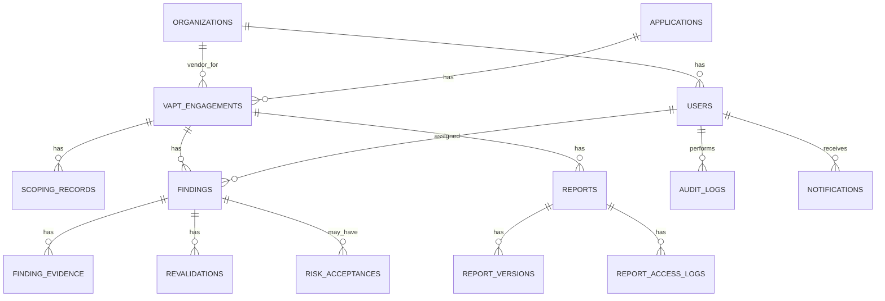

# VAPT Tracker Portal Database Design

## Version 1.0

---

# 1. Purpose

This document defines the database design for the VAPT Tracker Portal.

The database must support:

- Multi-party visibility for NBP, Paysys Labs, and external VAPT vendors
- Annual VAPT calendar tracking
- Engagement initiation and scoping
- Secure report repository metadata
- Password-protected PDF metadata
- Vulnerability findings lifecycle
- Fix evidence tracking
- Revalidation tracking
- Risk acceptance workflow
- Dashboards and reporting
- Complete audit trail

---

# 2. Database Technology

Recommended database:

```text
PostgreSQL
```

Recommended ORM:

```text
Prisma or TypeORM
```

Recommended migration strategy:

```text
Version-controlled database migrations
```

---

# 3. Design Principles

## 3.1 Auditability First

Every important change must be auditable.

No hard delete should be used for business records.

Use:

```text
is_deleted
deleted_at
deleted_by
```

where deletion is required.

## 3.2 Organization-Based Access

Every user belongs to an organization.

Organizations include:

- NBP
- Paysys Labs
- External Vendor, such as Apprise

## 3.3 Immutable Final Records

Final VAPT reports and closed engagements should not be modified directly.

Corrections should be made through:

- New version
- Addendum
- Audit entry

## 3.4 Secure Document Handling

Uploaded PDFs are stored in object storage.

The database stores:

- Metadata
- Storage key
- Hash
- Version
- Protection flag

The database must never store:

- PDF passwords
- Decrypted PDF contents
- Test account passwords
- API keys
- Secrets

---

# 4. Entity Relationship Diagram



---

# 5. Core Tables

## 5.1 organizations

Stores organizations using the system.

Examples:

- NBP
- Paysys Labs
- Apprise

| Column | Type | Required | Description |
|---|---|---:|---|
| id | UUID | Yes | Primary key |
| name | VARCHAR(150) | Yes | Organization name |
| organization_type | VARCHAR(50) | Yes | NBP, PAYSYS, VENDOR, AUDITOR |
| status | VARCHAR(30) | Yes | ACTIVE, INACTIVE |
| created_at | TIMESTAMP | Yes | Creation timestamp |
| updated_at | TIMESTAMP | No | Last update timestamp |

Constraint:

```sql
UNIQUE (name)
```

---

## 5.2 users

Stores portal users mapped with Keycloak users.

In `v0.2.0`, users are synchronized from authenticated Keycloak token claims on API access.

| Column | Type | Required | Description |
|---|---|---:|---|
| id | UUID | Yes | Primary key |
| organization_id | UUID | Yes | FK to organizations |
| keycloak_user_id | VARCHAR(150) | Yes | External identity ID |
| full_name | VARCHAR(150) | Yes | User full name |
| email | VARCHAR(150) | Yes | User email |
| role | VARCHAR(80) | Yes | System role |
| status | VARCHAR(30) | Yes | ACTIVE, INACTIVE |
| last_login_at | TIMESTAMP | No | Last login |
| created_at | TIMESTAMP | Yes | Creation timestamp |
| updated_at | TIMESTAMP | No | Last update timestamp |

Constraints:

```sql
UNIQUE (email)
UNIQUE (keycloak_user_id)
```

Suggested roles:

```text
NBP_SECURITY_ADMIN
NBP_VIEWER
PAYSYS_SECURITY_ADMIN
PAYSYS_DEVELOPER
VENDOR_ADMIN
AUDITOR
SYSTEM_ADMIN
```

---

# 6. Application Inventory

## 6.1 applications

Stores the applications/services covered under the VAPT calendar.

| Column | Type | Required | Description |
|---|---|---:|---|
| id | UUID | Yes | Primary key |
| name | VARCHAR(200) | Yes | Application name |
| description | TEXT | No | Application description |
| business_owner_name | VARCHAR(150) | No | Business owner |
| technical_owner_name | VARCHAR(150) | No | Technical owner |
| environment | VARCHAR(50) | Yes | PRODUCTION, STAGING, UAT, DEVELOPMENT |
| url | TEXT | No | Application URL |
| criticality | VARCHAR(30) | Yes | CRITICAL, HIGH, MEDIUM, LOW |
| technology_stack | TEXT | No | Technology summary |
| internet_facing | BOOLEAN | Yes | Whether externally exposed |
| status | VARCHAR(30) | Yes | ACTIVE, INACTIVE |
| created_by | UUID | Yes | FK to users |
| created_at | TIMESTAMP | Yes | Creation timestamp |
| updated_at | TIMESTAMP | No | Last update timestamp |

Indexes:

```sql
CREATE INDEX idx_applications_status ON applications(status);
CREATE INDEX idx_applications_criticality ON applications(criticality);
```

---

# 7. Annual VAPT Calendar and Engagements

## 7.1 vapt_engagements

Represents one VAPT run for one application.

Example:

```text
NBP Internet Banking - Whitebox - March 2026
```

| Column | Type | Required | Description |
|---|---|---:|---|
| id | UUID | Yes | Primary key |
| application_id | UUID | Yes | FK to applications |
| title | VARCHAR(250) | Yes | Engagement title |
| assessment_type | VARCHAR(50) | Yes | WHITEBOX, BLACK_GREY |
| planned_start_date | DATE | No | Planned start date |
| planned_end_date | DATE | No | Planned end date |
| planned_month | VARCHAR(20) | No | Calendar month |
| planned_year | INTEGER | Yes | Calendar year |
| actual_start_date | DATE | No | Actual start date |
| actual_end_date | DATE | No | Actual end date |
| vendor_organization_id | UUID | No | FK to organizations |
| nbp_owner_user_id | UUID | No | FK to users |
| paysys_owner_user_id | UUID | No | FK to users |
| status | VARCHAR(80) | Yes | Current lifecycle status |
| closure_notes | TEXT | No | Closure notes |
| closed_by | UUID | No | FK to users |
| closed_at | TIMESTAMP | No | Closure timestamp |
| created_by | UUID | Yes | FK to users |
| created_at | TIMESTAMP | Yes | Creation timestamp |
| updated_at | TIMESTAMP | No | Last update timestamp |

Engagement status values:

```text
PLANNED
PAYSYS_APPRISE_INITIATED
APPRISE_ASSESSMENT
DRAFT_REPORT_UPLOADED
PAYSYS_TRIAGE
DEVELOPER_FIX
FIXED_PENDING_REVALIDATION
APPRISE_REVALIDATION
FINAL_REPORT_UPLOADED
PAYSYS_IS_REVIEW_AND_COMMENT
NBP_IS_REVIEW_CLOSING_MEETING
CLOSED
GO_LIVE
CANCELLED
```

Indexes:

```sql
CREATE INDEX idx_engagement_application ON vapt_engagements(application_id);
CREATE INDEX idx_engagement_year_month ON vapt_engagements(planned_year, planned_month);
CREATE INDEX idx_engagement_status ON vapt_engagements(status);
CREATE INDEX idx_engagement_vendor ON vapt_engagements(vendor_organization_id);
```

---

# 8. Scoping and Initiation

## 8.1 scoping_records

Stores formal scoping meeting information. The first Engagement Initiation meeting is between Paysys and Apprise / External VAPT Vendor; Bank / NBP attendance is optional and can be captured in the participants field when present.

| Column | Type | Required | Description |
|---|---|---:|---|
| id | UUID | Yes | Primary key |
| engagement_id | UUID | Yes | FK to vapt_engagements |
| meeting_date | DATE | Yes | Scoping meeting date |
| meeting_time | TIME | No | Scoping meeting time |
| participants | TEXT | Yes | Participant list, including optional Bank / NBP attendees if present |
| minutes | TEXT | No | Meeting notes |
| scope_included | TEXT | Yes | In-scope items |
| scope_excluded | TEXT | No | Out-of-scope items |
| testing_window_start | TIMESTAMP | No | Approved test start |
| testing_window_end | TIMESTAMP | No | Approved test end |
| test_accounts_summary | TEXT | No | Non-secret account summary |
| architecture_summary | TEXT | No | High-level architecture notes |
| record_status | VARCHAR(50) | Yes | DRAFT, FINAL |
| created_by | UUID | Yes | FK to users |
| created_at | TIMESTAMP | Yes | Creation timestamp |
| updated_at | TIMESTAMP | No | Last update timestamp |

Security note: do not store test account passwords in this table.

---

# 9. Report Repository

## 9.1 reports

Stores logical report records.

Report types:

```text
DRAFT_REPORT
REVALIDATION_REPORT
FINAL_REPORT
RISK_ACCEPTANCE_DOCUMENT
EVIDENCE_DOCUMENT
ADDENDUM
```

| Column | Type | Required | Description |
|---|---|---:|---|
| id | UUID | Yes | Primary key |
| engagement_id | UUID | Yes | FK to vapt_engagements |
| report_type | VARCHAR(80) | Yes | Type of report |
| title | VARCHAR(250) | Yes | Report title |
| description | TEXT | No | Description |
| current_version | INTEGER | Yes | Latest version number |
| status | VARCHAR(50) | Yes | ACTIVE, ARCHIVED |
| immutable | BOOLEAN | Yes | Whether locked from changes |
| created_by | UUID | Yes | FK to users |
| created_at | TIMESTAMP | Yes | Creation timestamp |
| updated_at | TIMESTAMP | No | Last update timestamp |

## 9.2 report_versions

Stores every uploaded version of a report.

| Column | Type | Required | Description |
|---|---|---:|---|
| id | UUID | Yes | Primary key |
| report_id | UUID | Yes | FK to reports |
| version_number | INTEGER | Yes | Version number |
| file_name | VARCHAR(255) | Yes | Original file name |
| file_mime_type | VARCHAR(100) | Yes | MIME type |
| file_size_bytes | BIGINT | Yes | File size |
| object_storage_key | TEXT | Yes | MinIO object key |
| sha256_hash | VARCHAR(64) | Yes | File integrity hash |
| is_password_protected | BOOLEAN | Yes | Protected PDF flag |
| uploaded_by | UUID | Yes | FK to users |
| uploaded_at | TIMESTAMP | Yes | Upload timestamp |
| upload_notes | TEXT | No | Notes |

Constraints:

```sql
UNIQUE (report_id, version_number)
UNIQUE (sha256_hash)
```

Security note: do not store PDF passwords.

## 9.3 report_access_logs

Tracks report viewing and downloading.

| Column | Type | Required | Description |
|---|---|---:|---|
| id | UUID | Yes | Primary key |
| report_version_id | UUID | Yes | FK to report_versions |
| user_id | UUID | Yes | FK to users |
| action | VARCHAR(50) | Yes | VIEW_REQUESTED, VIEW_SUCCESS, VIEW_FAILED, DOWNLOADED |
| success | BOOLEAN | Yes | Whether action succeeded |
| failure_reason | VARCHAR(150) | No | Generic reason only |
| ip_address | VARCHAR(80) | No | User IP |
| user_agent | TEXT | No | Browser info |
| created_at | TIMESTAMP | Yes | Timestamp |

Security note: do not store entered PDF passwords.

---

# 10. Findings Management

## 10.1 findings

Stores individual vulnerabilities.

| Column | Type | Required | Description |
|---|---|---:|---|
| id | UUID | Yes | Primary key |
| engagement_id | UUID | Yes | FK to vapt_engagements |
| source_report_version_id | UUID | No | FK to report_versions |
| finding_reference | VARCHAR(100) | Yes | Vendor or system finding ID |
| title | VARCHAR(300) | Yes | Finding title |
| description | TEXT | Yes | Finding description |
| impact | TEXT | No | Business/security impact |
| recommendation | TEXT | No | Recommended fix |
| severity | VARCHAR(30) | Yes | CRITICAL, HIGH, MEDIUM, LOW, INFORMATIONAL |
| cvss_score | NUMERIC(3,1) | No | Optional CVSS score |
| cwe | VARCHAR(50) | No | CWE reference |
| owasp_category | VARCHAR(100) | No | OWASP category |
| status | VARCHAR(80) | Yes | Finding lifecycle status |
| assigned_to_user_id | UUID | No | FK to users |
| due_date | DATE | No | Target fix date |
| fixed_at | TIMESTAMP | No | Fix timestamp |
| closed_at | TIMESTAMP | No | Closure timestamp |
| closed_by | UUID | No | FK to users |
| created_by | UUID | Yes | FK to users |
| created_at | TIMESTAMP | Yes | Creation timestamp |
| updated_at | TIMESTAMP | No | Last update timestamp |

Finding status values:

```text
OPEN
ASSIGNED
IN_PROGRESS
FIX_IMPLEMENTED
FIXED_PENDING_REVALIDATION
REVALIDATION_PASSED
REVALIDATION_FAILED
RISK_ACCEPTANCE_REQUESTED
RISK_ACCEPTED
CLOSED
```

Indexes:

```sql
CREATE INDEX idx_findings_engagement ON findings(engagement_id);
CREATE INDEX idx_findings_status ON findings(status);
CREATE INDEX idx_findings_severity ON findings(severity);
CREATE INDEX idx_findings_assigned_to ON findings(assigned_to_user_id);
CREATE INDEX idx_findings_due_date ON findings(due_date);
```

## 10.2 finding_status_history

Stores status changes for each finding.

| Column | Type | Required | Description |
|---|---|---:|---|
| id | UUID | Yes | Primary key |
| finding_id | UUID | Yes | FK to findings |
| old_status | VARCHAR(80) | No | Previous status |
| new_status | VARCHAR(80) | Yes | New status |
| changed_by | UUID | Yes | FK to users |
| comments | TEXT | No | Change remarks |
| changed_at | TIMESTAMP | Yes | Timestamp |

---

# 11. Remediation Evidence

## 11.1 finding_evidence

Stores fix evidence.

Evidence types:

```text
SCREENSHOT
JIRA_REFERENCE
GIT_COMMIT
CONFIG_CHANGE
DEPLOYMENT_EVIDENCE
TEST_RESULT
DOCUMENT
OTHER
```

| Column | Type | Required | Description |
|---|---|---:|---|
| id | UUID | Yes | Primary key |
| finding_id | UUID | Yes | FK to findings |
| evidence_type | VARCHAR(80) | Yes | Evidence type |
| title | VARCHAR(250) | Yes | Evidence title |
| notes | TEXT | No | Evidence notes |
| file_object_key | TEXT | No | MinIO key if file attached |
| file_name | VARCHAR(255) | No | Original file name |
| jira_reference | VARCHAR(150) | No | JIRA issue reference |
| git_commit_reference | VARCHAR(150) | No | Git commit reference |
| uploaded_by | UUID | Yes | FK to users |
| uploaded_at | TIMESTAMP | Yes | Upload timestamp |

---

# 12. Revalidation

## 12.1 revalidations

Stores revalidation attempts by vendor.

| Column | Type | Required | Description |
|---|---|---:|---|
| id | UUID | Yes | Primary key |
| finding_id | UUID | Yes | FK to findings |
| engagement_id | UUID | Yes | FK to vapt_engagements |
| revalidation_date | DATE | Yes | Revalidation date |
| result | VARCHAR(50) | Yes | PASSED, FAILED |
| remarks | TEXT | No | Vendor remarks |
| performed_by | UUID | Yes | FK to users |
| report_version_id | UUID | No | FK to report_versions |
| created_at | TIMESTAMP | Yes | Timestamp |

---

# 13. Risk Acceptance

## 13.1 risk_acceptances

Stores risk acceptance decisions.

| Column | Type | Required | Description |
|---|---|---:|---|
| id | UUID | Yes | Primary key |
| finding_id | UUID | Yes | FK to findings |
| requested_by | UUID | Yes | FK to users |
| risk_description | TEXT | Yes | Risk description |
| business_justification | TEXT | Yes | Justification |
| mitigating_controls | TEXT | No | Compensating controls |
| expiry_date | DATE | Yes | Acceptance expiry |
| status | VARCHAR(50) | Yes | REQUESTED, APPROVED, REJECTED, EXPIRED |
| nbp_approver_user_id | UUID | No | FK to users |
| paysys_approver_user_id | UUID | No | FK to users |
| approved_at | TIMESTAMP | No | Approval timestamp |
| rejected_at | TIMESTAMP | No | Rejection timestamp |
| rejection_reason | TEXT | No | Reason for rejection |
| created_at | TIMESTAMP | Yes | Creation timestamp |
| updated_at | TIMESTAMP | No | Last update timestamp |

---

# 14. Notifications

## 14.1 notifications

Stores in-app and email notification records.

| Column | Type | Required | Description |
|---|---|---:|---|
| id | UUID | Yes | Primary key |
| user_id | UUID | Yes | FK to users |
| notification_type | VARCHAR(80) | Yes | Notification type |
| title | VARCHAR(250) | Yes | Notification title |
| message | TEXT | Yes | Notification body |
| entity_type | VARCHAR(80) | No | Related entity |
| entity_id | UUID | No | Related entity ID |
| is_read | BOOLEAN | Yes | Read flag |
| email_sent | BOOLEAN | Yes | Email sent flag |
| created_at | TIMESTAMP | Yes | Creation timestamp |
| read_at | TIMESTAMP | No | Read timestamp |

---

# 15. Audit Trail

## 15.1 audit_logs

Stores immutable audit logs.

| Column | Type | Required | Description |
|---|---|---:|---|
| id | UUID | Yes | Primary key |
| user_id | UUID | No | FK to users |
| organization_id | UUID | No | FK to organizations |
| action | VARCHAR(120) | Yes | Action performed |
| entity_type | VARCHAR(80) | Yes | Entity affected |
| entity_id | UUID | No | Entity ID |
| old_value | JSONB | No | Previous value |
| new_value | JSONB | No | New value |
| remarks | TEXT | No | Remarks |
| ip_address | VARCHAR(80) | No | User IP |
| user_agent | TEXT | No | Browser or client |
| created_at | TIMESTAMP | Yes | Timestamp |

Common audit actions:

```text
USER_LOGIN
APPLICATION_CREATED
APPLICATION_UPDATED
CALENDAR_ENTRY_CREATED
CALENDAR_ENTRY_UPDATED
ENGAGEMENT_CREATED
SCOPING_RECORD_CREATED
SCOPING_RECORD_UPDATED
REPORT_UPLOADED
REPORT_VIEW_REQUESTED
REPORT_VIEW_SUCCESS
REPORT_VIEW_FAILED
REPORT_DOWNLOADED
FINDING_CREATED
FINDING_ASSIGNED
FINDING_STATUS_CHANGED
FINDING_SEVERITY_CHANGED
EVIDENCE_UPLOADED
REVALIDATION_REQUESTED
REVALIDATION_PASSED
REVALIDATION_FAILED
RISK_ACCEPTANCE_REQUESTED
RISK_ACCEPTANCE_APPROVED
RISK_ACCEPTANCE_REJECTED
ENGAGEMENT_CLOSED
```

Security note: never log passwords, PDF passwords, access tokens, API keys, or secrets.

---

# 16. Reference Tables

The following lookup tables may be created instead of free-text statuses.

## 16.1 ref_severities

```text
CRITICAL
HIGH
MEDIUM
LOW
INFORMATIONAL
```

## 16.2 ref_assessment_types

```text
WHITEBOX
BLACK_GREY
```

## 16.3 ref_engagement_statuses

```text
PLANNED
PAYSYS_APPRISE_INITIATED
APPRISE_ASSESSMENT
DRAFT_REPORT_UPLOADED
PAYSYS_TRIAGE
DEVELOPER_FIX
FIXED_PENDING_REVALIDATION
APPRISE_REVALIDATION
FINAL_REPORT_UPLOADED
PAYSYS_IS_REVIEW_AND_COMMENT
NBP_IS_REVIEW_CLOSING_MEETING
CLOSED
GO_LIVE
CANCELLED
```

## 16.4 ref_finding_statuses

```text
OPEN
ASSIGNED
IN_PROGRESS
FIX_IMPLEMENTED
FIXED_PENDING_REVALIDATION
REVALIDATION_PASSED
REVALIDATION_FAILED
RISK_ACCEPTANCE_REQUESTED
RISK_ACCEPTED
CLOSED
```

---

# 17. Suggested PostgreSQL DDL Starter

This is a simplified starter schema. The implementation team should convert this into ORM migrations.

```sql
CREATE EXTENSION IF NOT EXISTS "uuid-ossp";

CREATE TABLE organizations (
    id UUID PRIMARY KEY DEFAULT uuid_generate_v4(),
    name VARCHAR(150) NOT NULL UNIQUE,
    organization_type VARCHAR(50) NOT NULL,
    status VARCHAR(30) NOT NULL DEFAULT 'ACTIVE',
    created_at TIMESTAMP NOT NULL DEFAULT NOW(),
    updated_at TIMESTAMP
);

CREATE TABLE users (
    id UUID PRIMARY KEY DEFAULT uuid_generate_v4(),
    organization_id UUID NOT NULL REFERENCES organizations(id),
    keycloak_user_id VARCHAR(150) NOT NULL UNIQUE,
    full_name VARCHAR(150) NOT NULL,
    email VARCHAR(150) NOT NULL UNIQUE,
    role VARCHAR(80) NOT NULL,
    status VARCHAR(30) NOT NULL DEFAULT 'ACTIVE',
    last_login_at TIMESTAMP,
    created_at TIMESTAMP NOT NULL DEFAULT NOW(),
    updated_at TIMESTAMP
);

CREATE TABLE applications (
    id UUID PRIMARY KEY DEFAULT uuid_generate_v4(),
    name VARCHAR(200) NOT NULL,
    description TEXT,
    business_owner_name VARCHAR(150),
    technical_owner_name VARCHAR(150),
    environment VARCHAR(50) NOT NULL,
    url TEXT,
    criticality VARCHAR(30) NOT NULL,
    technology_stack TEXT,
    internet_facing BOOLEAN NOT NULL DEFAULT FALSE,
    status VARCHAR(30) NOT NULL DEFAULT 'ACTIVE',
    created_by UUID NOT NULL REFERENCES users(id),
    created_at TIMESTAMP NOT NULL DEFAULT NOW(),
    updated_at TIMESTAMP
);

CREATE TABLE vapt_engagements (
    id UUID PRIMARY KEY DEFAULT uuid_generate_v4(),
    application_id UUID NOT NULL REFERENCES applications(id),
    title VARCHAR(250) NOT NULL,
    assessment_type VARCHAR(50) NOT NULL,
    planned_start_date DATE,
    planned_end_date DATE,
    planned_month VARCHAR(20),
    planned_year INTEGER NOT NULL,
    actual_start_date DATE,
    actual_end_date DATE,
    vendor_organization_id UUID REFERENCES organizations(id),
    nbp_owner_user_id UUID REFERENCES users(id),
    paysys_owner_user_id UUID REFERENCES users(id),
    status VARCHAR(80) NOT NULL DEFAULT 'PLANNED',
    closure_notes TEXT,
    closed_by UUID REFERENCES users(id),
    closed_at TIMESTAMP,
    created_by UUID NOT NULL REFERENCES users(id),
    created_at TIMESTAMP NOT NULL DEFAULT NOW(),
    updated_at TIMESTAMP
);

CREATE TABLE scoping_records (
    id UUID PRIMARY KEY DEFAULT uuid_generate_v4(),
    engagement_id UUID NOT NULL REFERENCES vapt_engagements(id),
    meeting_date DATE NOT NULL,
    meeting_time TIME,
    participants TEXT NOT NULL,
    minutes TEXT,
    scope_included TEXT NOT NULL,
    scope_excluded TEXT,
    testing_window_start TIMESTAMP,
    testing_window_end TIMESTAMP,
    test_accounts_summary TEXT,
    architecture_summary TEXT,
    record_status VARCHAR(50) NOT NULL DEFAULT 'DRAFT',
    created_by UUID NOT NULL REFERENCES users(id),
    created_at TIMESTAMP NOT NULL DEFAULT NOW(),
    updated_at TIMESTAMP
);

CREATE TABLE reports (
    id UUID PRIMARY KEY DEFAULT uuid_generate_v4(),
    engagement_id UUID NOT NULL REFERENCES vapt_engagements(id),
    report_type VARCHAR(80) NOT NULL,
    title VARCHAR(250) NOT NULL,
    description TEXT,
    current_version INTEGER NOT NULL DEFAULT 1,
    status VARCHAR(50) NOT NULL DEFAULT 'ACTIVE',
    immutable BOOLEAN NOT NULL DEFAULT FALSE,
    created_by UUID NOT NULL REFERENCES users(id),
    created_at TIMESTAMP NOT NULL DEFAULT NOW(),
    updated_at TIMESTAMP
);

CREATE TABLE report_versions (
    id UUID PRIMARY KEY DEFAULT uuid_generate_v4(),
    report_id UUID NOT NULL REFERENCES reports(id),
    version_number INTEGER NOT NULL,
    file_name VARCHAR(255) NOT NULL,
    file_mime_type VARCHAR(100) NOT NULL,
    file_size_bytes BIGINT NOT NULL,
    object_storage_key TEXT NOT NULL,
    sha256_hash VARCHAR(64) NOT NULL,
    is_password_protected BOOLEAN NOT NULL DEFAULT FALSE,
    uploaded_by UUID NOT NULL REFERENCES users(id),
    uploaded_at TIMESTAMP NOT NULL DEFAULT NOW(),
    upload_notes TEXT,
    UNIQUE(report_id, version_number),
    UNIQUE(sha256_hash)
);

CREATE TABLE findings (
    id UUID PRIMARY KEY DEFAULT uuid_generate_v4(),
    engagement_id UUID NOT NULL REFERENCES vapt_engagements(id),
    source_report_version_id UUID REFERENCES report_versions(id),
    finding_reference VARCHAR(100) NOT NULL,
    title VARCHAR(300) NOT NULL,
    description TEXT NOT NULL,
    impact TEXT,
    recommendation TEXT,
    severity VARCHAR(30) NOT NULL,
    cvss_score NUMERIC(3,1),
    cwe VARCHAR(50),
    owasp_category VARCHAR(100),
    status VARCHAR(80) NOT NULL DEFAULT 'OPEN',
    assigned_to_user_id UUID REFERENCES users(id),
    due_date DATE,
    fixed_at TIMESTAMP,
    closed_at TIMESTAMP,
    closed_by UUID REFERENCES users(id),
    created_by UUID NOT NULL REFERENCES users(id),
    created_at TIMESTAMP NOT NULL DEFAULT NOW(),
    updated_at TIMESTAMP
);

CREATE TABLE finding_evidence (
    id UUID PRIMARY KEY DEFAULT uuid_generate_v4(),
    finding_id UUID NOT NULL REFERENCES findings(id),
    evidence_type VARCHAR(80) NOT NULL,
    title VARCHAR(250) NOT NULL,
    notes TEXT,
    file_object_key TEXT,
    file_name VARCHAR(255),
    jira_reference VARCHAR(150),
    git_commit_reference VARCHAR(150),
    uploaded_by UUID NOT NULL REFERENCES users(id),
    uploaded_at TIMESTAMP NOT NULL DEFAULT NOW()
);

CREATE TABLE revalidations (
    id UUID PRIMARY KEY DEFAULT uuid_generate_v4(),
    finding_id UUID NOT NULL REFERENCES findings(id),
    engagement_id UUID NOT NULL REFERENCES vapt_engagements(id),
    revalidation_date DATE NOT NULL,
    result VARCHAR(50) NOT NULL,
    remarks TEXT,
    performed_by UUID NOT NULL REFERENCES users(id),
    report_version_id UUID REFERENCES report_versions(id),
    created_at TIMESTAMP NOT NULL DEFAULT NOW()
);

CREATE TABLE risk_acceptances (
    id UUID PRIMARY KEY DEFAULT uuid_generate_v4(),
    finding_id UUID NOT NULL REFERENCES findings(id),
    requested_by UUID NOT NULL REFERENCES users(id),
    risk_description TEXT NOT NULL,
    business_justification TEXT NOT NULL,
    mitigating_controls TEXT,
    expiry_date DATE NOT NULL,
    status VARCHAR(50) NOT NULL DEFAULT 'REQUESTED',
    nbp_approver_user_id UUID REFERENCES users(id),
    paysys_approver_user_id UUID REFERENCES users(id),
    approved_at TIMESTAMP,
    rejected_at TIMESTAMP,
    rejection_reason TEXT,
    created_at TIMESTAMP NOT NULL DEFAULT NOW(),
    updated_at TIMESTAMP
);

CREATE TABLE audit_logs (
    id UUID PRIMARY KEY DEFAULT uuid_generate_v4(),
    user_id UUID REFERENCES users(id),
    organization_id UUID REFERENCES organizations(id),
    action VARCHAR(120) NOT NULL,
    entity_type VARCHAR(80) NOT NULL,
    entity_id UUID,
    old_value JSONB,
    new_value JSONB,
    remarks TEXT,
    ip_address VARCHAR(80),
    user_agent TEXT,
    created_at TIMESTAMP NOT NULL DEFAULT NOW()
);
```

---

# 18. Dashboard Query Examples

## 18.1 Open Findings by Severity

```sql
SELECT
    severity,
    COUNT(*) AS total
FROM findings
WHERE status NOT IN ('CLOSED', 'RISK_ACCEPTED')
GROUP BY severity
ORDER BY severity;
```

## 18.2 Engagements by Status

```sql
SELECT
    status,
    COUNT(*) AS total
FROM vapt_engagements
GROUP BY status
ORDER BY status;
```

## 18.3 Application Heatmap

```sql
SELECT
    a.name AS application_name,
    f.severity,
    COUNT(*) AS total
FROM findings f
JOIN vapt_engagements e ON f.engagement_id = e.id
JOIN applications a ON e.application_id = a.id
WHERE f.status NOT IN ('CLOSED', 'RISK_ACCEPTED')
GROUP BY a.name, f.severity
ORDER BY a.name, f.severity;
```

## 18.4 Overdue Findings

```sql
SELECT
    f.finding_reference,
    f.title,
    f.severity,
    f.status,
    f.due_date,
    a.name AS application_name
FROM findings f
JOIN vapt_engagements e ON f.engagement_id = e.id
JOIN applications a ON e.application_id = a.id
WHERE f.due_date < CURRENT_DATE
  AND f.status NOT IN ('CLOSED', 'RISK_ACCEPTED');
```

---

# 19. Data Retention

| Data Type | Retention |
|---|---:|
| Engagement Records | 7 years |
| Reports | 7 years or as per NBP policy |
| Findings | 7 years |
| Audit Logs | 7 years |
| Report Access Logs | 7 years |
| Notifications | 1 year |

---

# 20. Database Success Criteria

The database design is successful when:

- Every VAPT run can be tracked from calendar to closure
- Every report has metadata, version, hash, and access history
- Every finding has full lifecycle history
- Every fix and revalidation is traceable
- Every risk acceptance has approvals and expiry
- Every important action is auditable
- No sensitive passwords or secrets are stored
